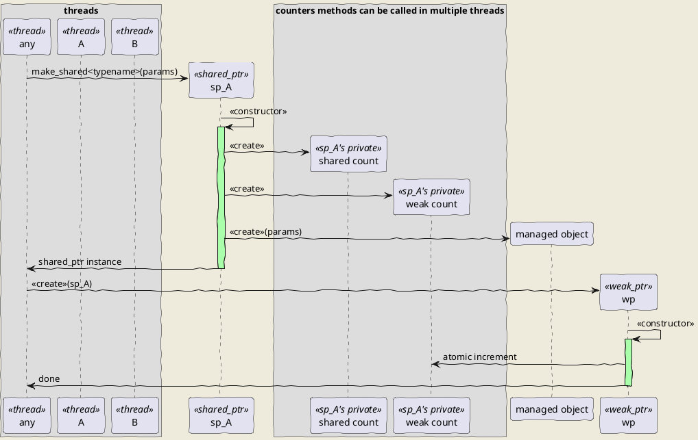
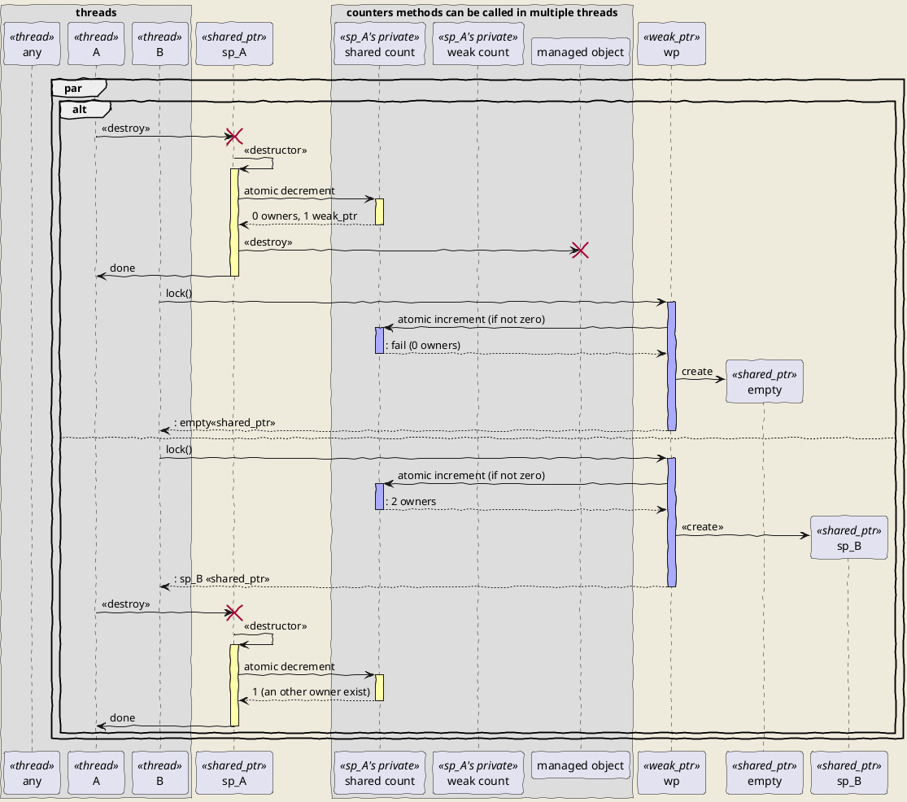
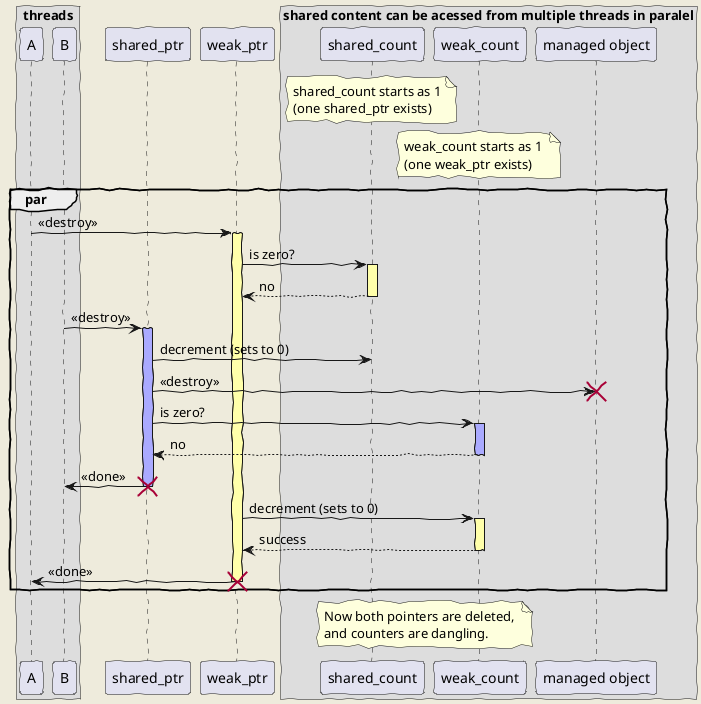
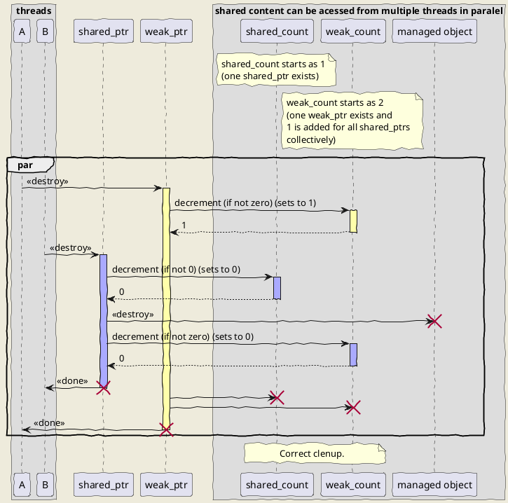

## Detailed version (owner count and weak count)
### Create one shared_ptr and one weak_ptr

### weak_ptr.lock() while destroing last shared_ptr

### Example: 
- Shared_count keeps number of shared_ptrs pointing to the managed object.
- Weak_count keeps number of weak_ptrs pointing to the managed object.
- Shared_count and weak_count are stored in an object acessible from shared_ptr and weak_ptr.

Note: If shared count and weak_count are separately allocated objects, they can be destructed one by one.
But then weak_ptr.lock() needs to refer shared_count. And it can be destructed at the time.

### Solution: keep one weak count celectively for all strong counts.
Let's examine destruction of last shared_ptr and weak_ptr.

It's not important if thread A or theread B sets weak count to 0.
It's destroyed by whichever set's it to zero.
Notes: During implementation we can use method for decrement and destroy if zero.
But preffer non-member function because later we can use allocators and they are not known to counters)

